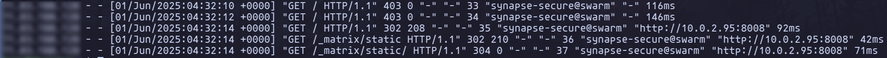

# HomeLab demo
A walkthrough of how my HomeLab works

Most of the files are modifications from [Jim's Garage](https://github.com/JamesTurland/JimsGarage/blob/main/Docker-Swarm/swarm-3-nodes.sh) 

Check out his [Channel](https://www.youtube.com/@Jims-Garage)
## Hardware
2 physical machines and 1 virtual machine

## Operating System
Using Ubuntu and Linux Mint

### Why?
I am comfortable using ubuntu and its derivatives and I already had Mint installed on one of my machines. Would like to move to a server OS in the future.

## Essential Tools

### Docker Swarm
[Doc](https://docs.docker.com/engine/swarm/) 

An excellent alternative to Kubernetes due to its simple design and configurations.

Ensures that my container are highly available(HA). This means that if one of my services go down then another machine/node can try to start up that failed 
service.

Very easy to scale up or down. Meaning that adding more machines to the Swarm will be very easy.

### GlusterFS
Distributed storage

Creates a volume on the hosts directory for file sharing

### Traefik
[Doc](https://doc.traefik.io/traefik/)

An http proxy and load-balancer for services.

Use Case: 
- By using Traefik with Cloudflare certificates, I can easily assign a domain to my applications. I can also leverage the load-balancer to have multiple application use the same port. The most used one would be port 80 and 443.
- Creates logs that can show Traefik info and the real client IP(Only if someone is accessing a public service through cloudflare tunnel)

Note that the public IP of the client will be blurred.

### Tailscale
Mesh VPN to connect machines across the internet.

## Services
### Crowdsec
[Doc](https://docs.crowdsec.net/)

A service that has a community driven database of known malware/attacks and will ban IP's that have done so.

There is a Crowdsec website that allows you to manage security engines(The crowdsec containers)

Here is a very helpful [blog](https://blog.lrvt.de/configuring-crowdsec-with-traefik/#attack-simulation) on how to setup Traefik and Crowdsec.

Use case: Crowdsec will read through Traefik logs to analyze any suspicious activity. 

### Pihole

### Grafana-Monitoring

### Matrix

### Portainer
